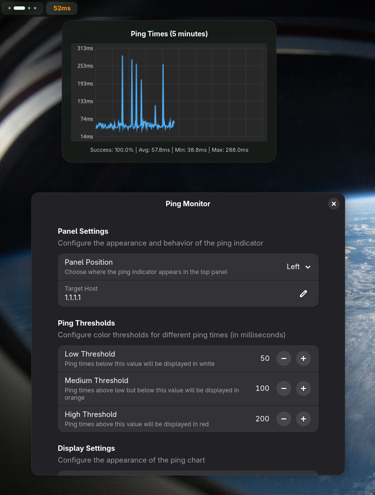

# Ping Monitor

**Network latency monitoring for GNOME Shell**

Monitor your network connectivity with real-time ping statistics displayed directly in your top panel. This extension provides continuous latency monitoring to Cloudflare's 1.1.1.1 DNS service with visual feedback and historical data visualization.



## What it does

This extension continuously monitors network latency by pinging 1.1.1.1 and displays the results in your GNOME Shell top bar. Key capabilities include:

- **Live ping monitoring** with 1-second intervals
- **Visual status indicator** in the top panel with color-coded latency levels
- **Historical chart view** showing 5 minutes of ping data
- **Customizable thresholds** for good/warning/poor connection states
- **Minimal resource usage** with efficient background monitoring

## System Requirements

- GNOME Shell 45 or later
- System `ping` utility (pre-installed on most Linux distributions)
- Active network connection

## Quick Installation

1. **Clone the repository:**
   ```bash
   git clone https://github.com/micahparker/ping-monitor.git
   cd ping-monitor
   ```

2. **Install to extensions directory:**
   ```bash
   cp -r . ~/.local/share/gnome-shell/extensions/ping@micahparker.com/
   ```

3. **Enable the extension:**
   ```bash
   gnome-extensions enable ping@micahparker.com
   ```

4. **Restart GNOME Shell** (X11: `Alt+F2` → `r` → Enter, or logout/login for Wayland)

## Detailed Setup
If you prefer a more traditional approach or need to troubleshoot:

### Prerequisites
Ensure GNOME Extensions support is available on your system:
```bash
# On Ubuntu/Debian
sudo apt install gnome-shell-extensions

# On Fedora
sudo dnf install gnome-extensions-app
```

### Manual Installation Process

1. **Prepare the extensions directory:**
   ```bash
   mkdir -p ~/.local/share/gnome-shell/extensions/ping@micahparker.com
   ```

2. **Copy extension files:**
   ```bash
   cp -r * ~/.local/share/gnome-shell/extensions/ping@micahparker.com/
   ```

3. **Verify installation:**
   ```bash
   gnome-extensions list | grep ping
   ```

4. **Enable via Extensions app or command line:**
   ```bash
   gnome-extensions enable ping@micahparker.com
   ```

The extension directory structure:
```
~/.local/share/gnome-shell/extensions/ping@micahparker.com/
├── extension.js          # Main extension logic
├── metadata.json         # Extension metadata
├── prefs.js             # Preferences dialog
├── stylesheet.css       # UI styling
├── schemas/             # Settings schema
│   ├── gschemas.compiled
│   └── org.gnome.shell.extensions.ping.gschema.xml
└── static/
    └── Screenshot.png
```

## Configuration Options

Access extension preferences through:
- Extensions app → Ping Monitor → Settings gear icon
- Command: `gnome-extensions prefs ping@micahparker.com`

Available settings:
- Ping interval timing
- Latency thresholds (good/warning/poor)
- Display format options
- Target host configuration

## Development & Testing

### Running in Development Mode
For testing changes without affecting your main session:
```bash
dbus-run-session -- gnome-shell --nested --wayland
```

### Debugging
Monitor extension activity:
```bash
journalctl --user -f | grep -i ping
```

## Troubleshooting

**Extension not appearing in top bar:**
- Verify GNOME Shell version compatibility
- Check if extension is enabled: `gnome-extensions list --enabled`
- Restart GNOME Shell session

**No ping data showing:**
- Confirm `ping` command availability: `which ping`
- Test manual ping: `ping -c 1 1.1.1.1`
- Check network connectivity

**Performance issues:**
- Review ping interval settings in preferences
- Monitor system resources during operation

## Technical Details

This extension uses:
- GNOME Shell Extension API for UI integration
- System `ping` command via GLib subprocess calls
- Cairo graphics for chart rendering
- GSettings for configuration persistence

## Contributing

Issues and pull requests welcome at: https://github.com/micahparker/ping-monitor

## License

Distributed under the terms of the GPL-2.0-or-later. See the `LICENSE` file for details.